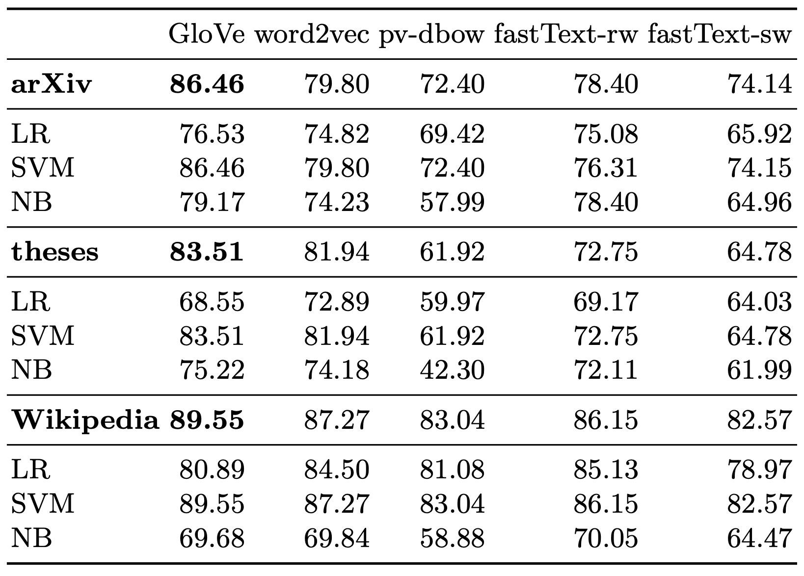
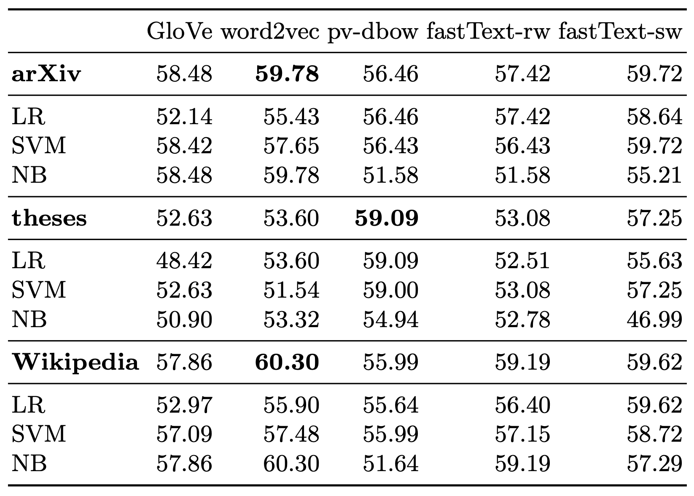
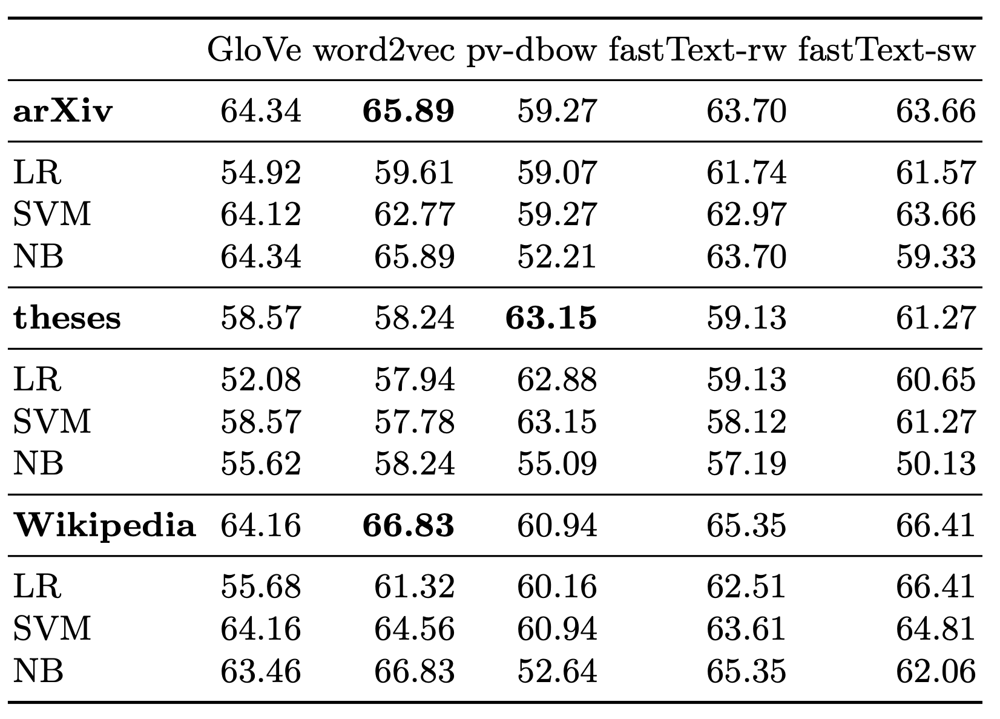

# Identifying Machine-Paraphrased Plagiarism

This repositroy implements the paper "Identifying Machine-Paraphrased Plagiarism". 
We structure the repository in two parts: (1) the classical machine learning models relying on static word embeddings, and (2) the neural language models learning paraphrase detection end-to-end.

You can find detailled descriptions on how to reconstruct each of the experiments in the respective README files.

## Dataset
The dataset that was created for this publication can be downloaded from [Zenodo](https://zenodo.org/record/3608000). If you want to evaluate the neural language models, you can also use the `NLM/prepare_data.sh` script which will download and and extract the data for you.

## Machine Learning Models
To reproduce the experiments, follow [ML-README](./ML/README.md).

The detailed results for each experiment of the machine learning models can be concluded with the following three tables:

### Spinbot

### Spinnerchief-DF

### Spinnerchief-IF

## Neural Language Models
To reproduce the experiments, follow [NLM-README](./NLM/README.md).

The checkpoints for each experiment can be found under the [huggingface models](https://huggingface.co/models). The names for our models are:

* jpelhaw/bert-base-uncased-pd
* jpelhaw/bart-base-pd
* jpelhaw/xlnet-base-cased-pd
* jpelhaw/electra-base-discriminator-pd
* jpelhaw/longformer-base-4096-pd
* jpelhaw/albert-base-uncased-pd
* jpelhaw/distilbert-base-uncased-pd
* jpelhaw/roberta-base-pd

The detailed results for each experiments are shown in the following table:

## Citation
If you use this repository or the results from our paper for your research work, please cite us in the following way.

> tbd after publishing

If you used the dataset, please also cite.
@inproceedings{Foltynek2020,
  title = {Detecting {Machine}-obfuscated {Plagiarism}},
  booktitle = {Proceedings of the {iConference} 2020},
  author = {Folt{\'y}nek, Tom{\'a}{\v s} and Ruas, Terry and Scharpf, Philipp and Meuschke, Norman and Schubotz, Moritz and Grosky, William and Gipp, Bela},
  year = {2020},
series    = {Lecture Notes in Computer Science},
publisher = {Springer},
}
https://doi.org/10.5281/zenodo.3608000
